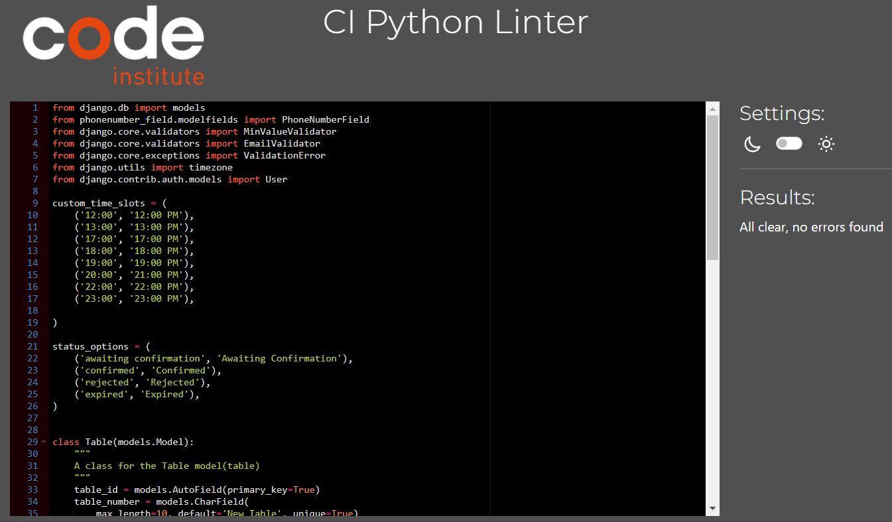

# Caribbeann Cove

**Developer: BWOGIT**

💻 [Visit live website](https://caiman-cove-3c81faa4aa99.herokuapp.com/)  
(Ctrl + click to open in new tab)

## Table of Contents
  - [About](#about)
  - [User Goals](#user-goals)
  - [Site Owner Goals](#site-owner-goals)
  - [User Experience](#user-experience)
  - [User Stories](#user-stories)
  - [Design](#design)
    - [Colours](#colours)
    - [Fonts](#fonts)
    - [Structure](#structure)
      - [Website pages](#website-pages)
      - [Database](#database)
    - [Wireframes](#wireframes)
  - [Technologies Used](#technologies-used)
  - [Features](#features)
  - [Validation](#validation)
  - [Testing](#testing)
    - [Manual testing](#manual-testing)
    - [Automated testing](#automated-testing)
    - [Tests on various devices](#tests-on-various-devices)
    - [Browser compatibility](#browser-compatibility)
  - [Bugs](#bugs)
  - [Heroku Deployment](#heroku-deployment)
  - [Credits](#credits)
  - [Acknowledgements](#acknowledgements)

### About

Caribbean Cove is a restaurant. This project is a smart interface which will allow the user to brose the menu online and make a reservation. The user can then view his reservations, edit and delete them.

### User Goals

- Make a reservation
- Manage Bookings
- Explore menus, a blog and contact info

### Site Owner Goals

- Enable online Table reservations
- Enhance business appeal with a polished website
- Deliver a User-Friendly Modern experience
- Ensure Full Responsiveness and Accessibility

## User Experience

### Target Audience
- Users that wish to book a table to experience culinary prestige and Glamour
- Tourists for memorable dining experience
- Attract local and visiting guests

### User Requirements and Expectations

- Seamless responsiveness across diverse devices and screen sizes
- Compliance with accessibility standards to ensure inclusivity
- Implementation of an inviting and user-centric design
- Integration of social media functionalities for enhanced engagement
- Clear presentation of relevant contact information
- Prioritization of accessibility features to ensure inclusiveness

##### Back to [top](#table-of-contents)

## User Stories

### Users
1.	As a User, I can Navigate the Site Easily and Intuitively:
2.	As a User, I can intuitively Use the Navbar, Footer, and Social Media Icons
3.	As a User, I can access a Page for enquiries or leave suggestions or coments
4.	As a User, I can quickly Access Opening Hours and Essential Information email, phone, and social media.
5.	As a User, I can Choose date/times to make reservations
6.	As a User, I can mofify booking and select another date/time
7.  As a User, I can Delete My Reservation
8.  As a User, I can view past and current reservations
9.  As a User, I can receive notofications for each event in the bookig process 
10. As a User, I can SignUp to be able to login and therefore book
11. As a User, I can Authenticate Myself tobe granted access to the app features
12. As a User, I can know my loggin status
13. As a User, I can read blogs
14. As a User, I can discover the restaurants food offering

### Admin / Privileged User
15.	As an Admin or Privileged User, I can Log In to Access the Site's Backend
16.	As an Admin or Privileged User, I can CRUD bookings for Phone or Email Reservations 
17. As an Admin or Privileged User, I can filter Bookings and Menus
18. As an Admin or Privileged User, I can Filter Bookings by Date for Specific Day Insight
19. As an Admin, I can Log In to Manage Food and Cocktail Menu Items
20.	As an Admin, I can CRUD Food and Drink Items in the Database

### Site Owner  
21. As a Site Owner, I Can Offer a Fully Responsive Site for Optimal User Experience
22. As a Site Owner, I Can Implement Data Validation to Ensure Accurate Submission.

### Kanban
- GitHub Kanban was used to track all open user stories
- Backlog, In Progress, Done headings were used in the kanban

Epics

User Stories

kanban

##### Back to [top](#table-of-contents)

## Design

### Colours

The choice of a dark background for the website draws inspiration from the allure of a luxurious jewelry box's dark material. This carefully selected color scheme serves to elevate the visual presentation of the website's content, especially the high-quality images of exquisite dishes and captivating ambiances. By embracing the dark backdrop, the website aims to create a sense of opulence and sophistication, mirroring the lavishness associated with the Caribbean Cove's culinary offerings

### Fonts

 The fonts selected were from Google Fonts, Montserrat wits sans-serif as a backup font.

### Structure

#### Website pages
The website design prioritizes user freindliness, featuring a top navigation bar for seamless navigation and a hamburger menu button for smaller screens. This ensures an intuitive user experience across devices.

Prominently featured in the footer are essential social media links, enabling users to engage with the business across various platforms. This strategic inclusion enhances the business's online presence, garnering followers, likes, and shares. The site features the following pages:

 - A dynamic homepage with intuitive cards for table booking and menu exploration.
 - A comprehensive food menu, thoughtfully sorted into starters, mains, and desserts, showcasing the rich array of culinary offerings.
 - An expansive drinks menu categorized by type, presenting a diverse selection of available beverages.
 - An engaging blog section, thoughtfully paginated, where authorized users share insights and experiences.
 - Detailed blog expansion offers users an opportunity to delve into selected content, with logged-in users contributing moderated comments.
 - The user-friendly booking page empowers registered users to effortlessly secure a table by specifying guest count, date, time, and desired table location.
 - The "My Bookings" section conveniently displays users' active reservations, automatically expiring past bookings.
 - The edit booking feature allows users to adapt reservation details, including date, time, table, and guest count.
 - The cancel booking option permits hassle-free reservation cancellation, removing bookings from the database.
 - The "Contact Us" page facilitates user communication via DM for registered users, or via the provided email, phone number, or physical  address.
 - The seamless "Login" and "Logout" functionality enables users to access booking features and reservation management.
 - The registration process empowers users to create accounts, facilitating access to the booking system.
 - A polished "404 Error" page elegantly addresses any encountered errors.

 #### Database

- Built with Python Django framework and Postgres for deployement to heroku

Show diagram

##### User Model
The User is a built-in Django feature and is used for authentication and has the following fields:
- user_id
- password
- last_login
- is_superuser
- username
- first_name
- last_name
- email
- is_staff
- is_active
- date_joined

Show model

##### FoodMenuItem Model
The FoodMenuItem Model contains the following fields:
- food_item_id
- food_item_name
- food_description
- food_price
- food_available

Show model

##### DrinkMenuItem Model
The DrinkIMenutem Model contains the following fields:
- drink_item_id
- drink_item_name
- drink_description
- drink_price
- drink_available

Show model

##### Table Model
The Table Model contains the following fields:
- table_id (PrimaryKey)
- capacity
- reserved
- table_number

Show model

##### Reservation Model
The Reservation Model contains the following fields:
- reservation_id (PrimaryKey)
- reserved_date
- requested_date
- reserved_time_slot
- table (ForeignKey)
- user (ForeignKey)
- guest_count
- name
- email
- phone
- status
- seats

Show model

##### Post Model
The Post Model contains the following:
- post_id (PrimaryKey)
- author (ForeignKey)
- content
- created_on
- excerpt
- featured_image
- slug
- status
- title
- updated_on

Show model

##### Comment Model
The Comment Model contains the following:
- id (primary Key)
- post (ForeignKey)
- approved
- body
- created_on
- email
- name

Show model

##### Contact Model
The Contact Model contains the following fields:
- message_id (PrimaryKey)
- user (ForeignKey)
- email 
- message
- name
- phone

Show model

### Wireframes
The wireframes were created using Balsamiq

#### home page
Home page responsive wireframes

#### meal/drink menu page
Menus responsive wireframes

#### book a table page
Book a table through this responsive and high quality app

#### View past and future bookings page (data gathering)
View bookings

#### Read the blogs page
Read the blogs from a variaty of interesting topics page

#### Contact Us page
Contact us and we will get backt to you

#### Logout page
You can now log ou in a safe manner. 

#### Login required (booking)
You have to log in before you book a table

#### Blog (login required)
Blog log in required

#### Blog Read more 
You have found the topic that you want to delve into.

#### Contact Us
Contact Us (loging Required)

#### Log IN
Responsive LogIn

#### Sign up
Responsive sign up page

## Technologies Used

### Languages & Frameworks

- HTML
- CSS
- Javascript
- Python
- Django

### Libraries & Tools

- [Am I Responsive](http://ami.responsivedesign.is/)
- [Balsamiq](https://balsamiq.com/)
- [Bootstrap v5.2](https://getbootstrap.com/)
- [Cloudinary](https://cloudinary.com/)
- [Favicon.io](https://favicon.io)
- [Chrome dev tools](https://developers.google.com/web/tools/chrome-devtools/)
- [Font Awesome](https://fontawesome.com/)
- [Git](https://git-scm.com/)
- [GitHub](https://github.com/)
- [Google Fonts](https://fonts.google.com/)
- [Heroku Platform](https://id.heroku.com/login)
- [jQuery](https://jquery.com)
- [Postgres](https://www.postgresql.org/)
- [Summernote](https://summernote.org/)
- Validation:
  - [WC3 Validator](https://validator.w3.org/)
  - [Jigsaw W3 Validator](https://jigsaw.w3.org/css-validator/)
  - [JShint](https://jshint.com/)
  - [Pycodestyle(PEP8)](https://pypi.org/project/pycodestyle/)
  - [Lighthouse](https://developers.google.com/web/tools/lighthouse/)
  - [Wave Validator](https://wave.webaim.org/)

  ##### Back to [top](#table-of-contents)

  ## Features

### Logo & Navigation
- Logo
- Responsive down to hamburger menu
- Indicates login/logout in status
- displayed on all pages (inc. 404)

See feature images

### Footer
- Includes social media links and all details of a modern business (email, telephone address, and opening hours)
- consistently visible on every page

See feature images

### Home page
- Home page includes nav bar, main body and a footer

See feature images

### Food Menu
- The food menu showcases a comprehensive selection of available dishes.
- The menu is categorized into starters, main courses, and desserts.
- Authorized staff members can edit the menu via the backend admin panel.
- uthorized staff members can perform actions such as creating, updating, and removing food items using the admin panel.
  

See feature images

### Drinks Menu
- The drink menu showcases a comprehensive selection of available drinks.
- The menu is categorized into non alcoholic, cocktails, beers and ruhums
- Authorized staff members can edit the menu via the backend admin panel.
- uthorized staff members can perform actions such as creating, updating, and removing drink items using the admin panel.

See feature images

### Login
- User is required to login to reserve a table, view bookings, 
edit and delete bookings and comment a blog.

See feature images

### Logout
- Allows the user to securely log out

See feature images

### Sign up / Register
- Allow users to create an acoount
- Use Django built-in authentication. Seameless.

See feature images

### Blog
- The blog displays each post made by authorised user
- The main blog list features exerpts and Pictures
- Paginations is used to display 2 posts per page
  

See feature images

### Blog Read More
- Click on read more to expand the selection you have chosen
- Registerd user can comment on the blog
- Staff can approve comments via the admin panel on the backend
  
  

See feature images

### Comments
- Comments made are set to pending approval status
- Only registered users can comment on a blog post
- Staff are the moderators
  

See feature images

### Pagination
- used on the blog page
- Ensures the page is kept tidy as only 2 items are displayed per page
  

See feature images

### Contact Us
- Registered users can DM staff via the message box
- Contact info such as,name, email, and address is displayed
  

See feature images

##### Back to [top](#table-of-contents)

## Validation

The W3C Markup Validation Service

Home

SingUp

Login

Logout

Bookings

Booking confirmation

Edit Booking

delete Booking

Meal Menu

Beverage Menu

Blog

Blog Read more

Contact Us

Confirmed

404

### CSS Validation
The W3C Jigsaw CSS Validation Service

Style.css

### PEP8 Validation
PEP8 Validation Service from CodeInstitute was used.
- [pep8ci](https://pep8ci.herokuapp.com/)

food_and_drinks

views.py

urls.py

models.py

admin.py

blog

views.py

urls.py

forms.py

models.py

admin.py

contact_us

views.py

models.py

urls.py

forms.py

admin.py

home

views.py

urls.py

reservations

views.py

urls.py

models.py

forms.py

admin.py

### Wave
WAVE was used to test the websites accessibility.

Login

Logout

Home

Meals

Beverages

Blog

Blog Detail1

Blog Detail2

Blog Detail3

Blog Detail4

Reservation Login

Reservation book

Reservation Confirmation

bookings list

Contact Us

Signup

### Lighthouse

Performance, best practices and SEO was tested using Lighthouse.

Meals

Drinks

blog1

blog2

Blog_detail1

Blog_detail2

Blog_detail3

Blog_detail4

bookings

Contact Us

login

logout

book

signup

home

##### Back to [top](#table-of-contents)

## Testing

### Manual testing

### User

1. As a User, I can Navigate the Site Easily and Intuitively

**Step** | **Expected Result** | **Actual Result**
------------ | ------------ | ------------ |
| Click on the links in the navigation bar or log | all pages will load| Works as expected |

2. As a User, I can intuitively Use the Navbar, Footer, and Social Media Icons

**Step** | **Expected Result** | **Actual Result**
------------ | ------------ | ------------ |
 | See test 1 | See test 1 | Works as expected |
 | Scroll to footer at bottom of page | Read information | Works as expected |
 | Scroll to footer at bottom of page | Use social media links | Works as expected |

3. As a User, I can access a Page for enquiries or leave suggestions or coments

**Step** | **Expected Result** | **Actual Result**
------------ | ------------ | ------------ |
 | Click on Contact Us link in the navbar | Fill out form | Works as expected |

4. As a User, I can quickly Access Opening Hours and Essential Information email, phone, and social media.

**Step** | **Expected Result** | **Actual Result**
------------ | ------------ | ------------ |
 Scroll to footer at bottom of page | Read information | Works as expected 

5. As a User, I can Choose date/times to make reservations

**Step** | **Expected Result** | **Actual Result**
------------ | ------------ | ------------ |
 |  |  |  |

6. As a User, I can modify booking and select another date/time

**Step** | **Expected Result** | **Actual Result**
------------ | ------------ | ------------ |
 |  |  |  |

7. As a User, I can Delete My Reservation

**Step** | **Expected Result** | **Actual Result**
------------ | ------------ | ------------ |
 |  |  |  |

8. As a User, I can view past and current reservations

**Step** | **Expected Result** | **Actual Result**
------------ | ------------ | ------------ |
 |  |  |  |

9. As a User, I can receive nototications for each event in the bookig process 

**Step** | **Expected Result** | **Actual Result**
------------ | ------------ | ------------ |
 |  |  |  |

10. As a User, I can SignUp to login

**Step** | **Expected Result** | **Actual Result**
------------ | ------------ | ------------ |
 |  |  |  |

11. As a User, I can Authenticate to be granted access to the app features

**Step** | **Expected Result** | **Actual Result**
------------ | ------------ | ------------ |
 |  |  |  |

12. As a User, I can Clearly Observe My Current Login Status

**Step** | **Expected Result** | **Actual Result**
------------ | ------------ | ------------ |
 |  |  |  |

13. As a User, I can read blogs

**Step** | **Expected Result** | **Actual Result**
------------ | ------------ | ------------ |
 |  |  |  |

14. As a User, I can Explore the Comprehensive Food and Drink offering

**Step** | **Expected Result** | **Actual Result**
------------ | ------------ | ------------ |
 |  |  |  |

### Admin

15. As an Admin or Privileged User, I can Log In to Access the Site's Backend

**Step** | **Expected Result** | **Actual Result**
------------ | ------------ | ------------ |
 |  |  |  |

16. As an Admin or Privileged User, I can CRUD bookings for Phone or Email Reservations

**Step** | **Expected Result** | **Actual Result**
------------ | ------------ | ------------ |
 |  |  |  |

17.  As an Admin or Privileged User, I can CRUD menus

**Step** | **Expected Result** | **Actual Result**
------------ | ------------ | ------------ |
 |  |  |  |

18. As a (Admin User), I can read customers opinions/reclamation/suggestions 

**Step** | **Expected Result** | **Actual Result**
------------ | ------------ | ------------ |
 |  |  |  |

19. As an Admin or Privileged User, I can Filter Bookings by Date for Specific Day Insight

**Step** | **Expected Result** | **Actual Result**
------------ | ------------ | ------------ |
 |  |  |  |

#### Site Owner

20. As a (site owner), I can ensure reservations are never for a time  prior to the bookign creation time

**Step** | **Expected Result** | **Actual Result**
------------ | ------------ | ------------ |
 |  |  |  |

21. As a (site owner), I can prevent 2 or more bookings for the same date/time

**Step** | **Expected Result** | **Actual Result**
------------ | ------------ | ------------ |
 |  |  |  |

22. As a Site Owner, I Can provide a Fully Responsive Site for Optimum User Experience

**Step** | **Expected Result** | **Actual Result**
------------ | ------------ | ------------ |
 |  |  |  |

23. As a Site Owner, I Can Implement Data Validation to Ensure Accurate Submission

**Step** | **Expected Result** | **Actual Result**
------------ | ------------ | ------------ |
 |  |  |  |

