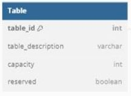
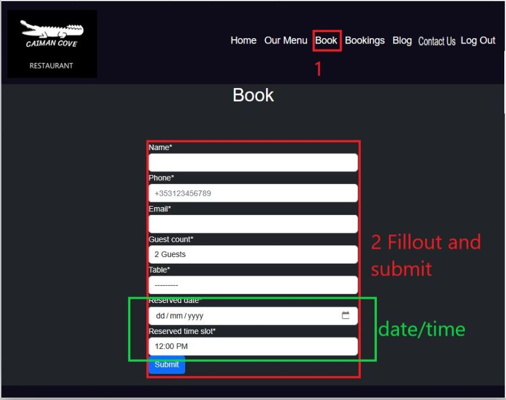
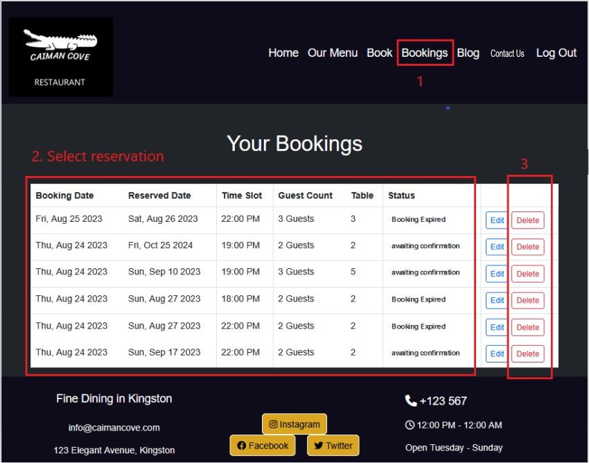
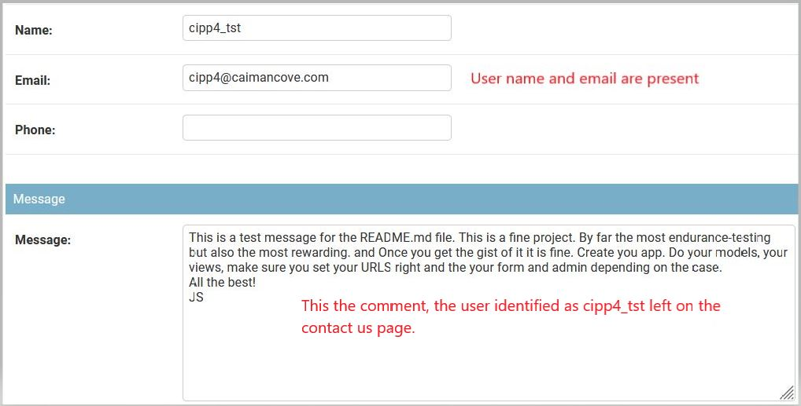
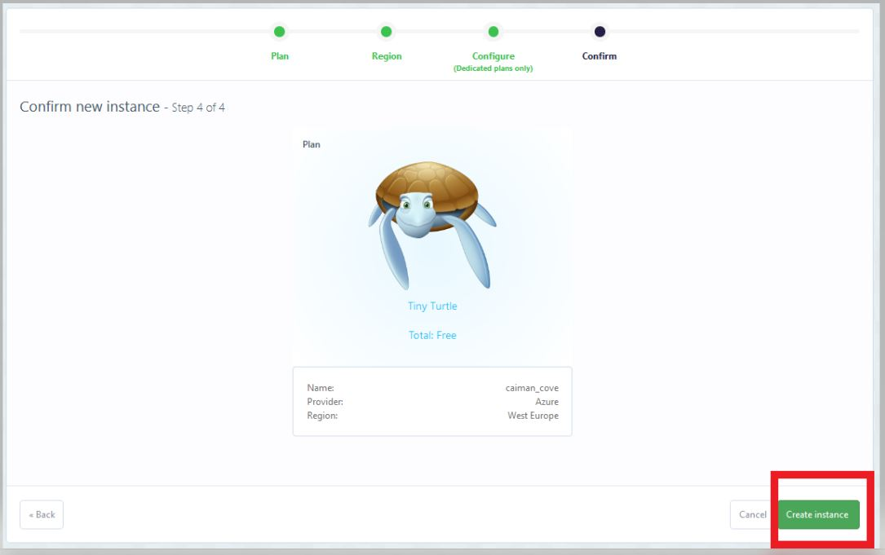
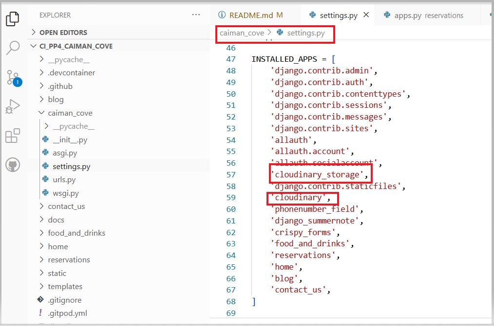
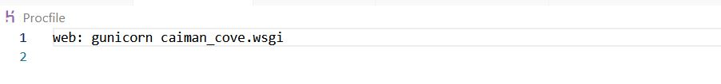

# Caiman Cove

**Developer: BWOGIT**

💻 [Visit live website](https://caiman-cove-3c81faa4aa99.herokuapp.com/)  
(Ctrl + click to open in new tab)

## Table of Contents
  - [About](#about)
  - [User Goals](#user-goals)
  - [Site Owner Goals](#site-owner-goals)
  - [User Experience](#user-experience)
  - [User Stories](#user-stories)
  - [Design](#design)
    - [Colours](#colours)
    - [Fonts](#fonts)
    - [Structure](#structure)
      - [Website pages](#website-pages)
      - [Database](#database)
    - [Wireframes](#wireframes)
  - [Technologies Used](#technologies-used)
  - [Features](#features)
  - [Validation](#validation)
  - [Testing](#testing)
    - [Manual testing](#manual-testing)
    - [Automated testing](#automated-testing)
    - [Tests on various devices](#tests-on-various-devices)
    - [Browser compatibility](#browser-compatibility)
  - [Bugs](#bugs)
  - [Future Development](#future-development)
  - [Heroku Deployment](#heroku-deployment)
  - [Credits](#credits)
  - [Acknowledgements](#acknowledgements)

### About

Caribbean Cove is a restaurant. This project is a smart interface which will allow the user to brose the menu online and make a reservation. The user can then view his reservations, edit and delete them.

### User Goals

- Make a reservation
- Manage Bookings
- Explore menus, a blog and contact info

### Site Owner Goals

- Enable online Table reservations
- Enhance business appeal with a polished website
- Deliver a User-Friendly Modern experience
- Ensure Full Responsiveness and Accessibility

## User Experience

### Target Audience
- Users that wish to book a table to experience culinary prestige and Glamour
- Tourists for memorable dining experience
- Attract local and visiting guests

### User Requirements and Expectations

- Seamless responsiveness across diverse devices and screen sizes
- Compliance with accessibility standards to ensure inclusivity
- Implementation of an inviting and user-centric design
- Integration of social media functionalities for enhanced engagement
- Clear presentation of relevant contact information
- Prioritization of accessibility features to ensure inclusiveness

##### Back to [top](#table-of-contents)

## User Stories

### Users
1. As a User, I can Navigate the Site Easily and Intuitively
2. As a User, I can intuitively Use the Navbar, Footer, and Social Media Icons
3. As a User, I can access a Page for enquiries or leave suggestions or comments
4. As a User, I can quickly Access Opening Hours and Essential Information email, phone, and social media.
5. As a User, I can Choose date/times to make reservations
6. As a User, I can modify booking and select another date/time
7. As a User, I can Delete My Reservation
8. As a User, I can view past and current valid reservations
9. As a User, I can receive notifications for each event in the booking process
10. As a User, I can SignUp to login
11. As a User, I can Authenticate to be granted access to the app features
12. As a User, I can Clearly Observe My Current Login Status
13. As a User, I can read blogs
14. As a User, I can Explore the Comprehensive Food and Drink offering

### Admin / Privileged User
15. As an Admin or Privileged User, I can Log In to Access the Site's Backend
16. As an Admin or Privileged User, I can CRUD bookings for Phone or Email Reservations
17.  As an Admin or Privileged User, I can CRUD menus items
18. As a (Admin User), I can read customers opinions/reclamation/suggestions
19. As an Admin or Privileged User, I can Filter Bookings by Date to have al bookings of the day
20. As an Admin or Privileged User, I can disable a users' account
21. As an admin or Priviledged user i can grant or deny or remove user's comment on blog
22. As an admin I can grant or revoke priviledged status

### Site Owner  
23. As a site owner, I can ensure reservations are never for a time  prior to the booking creation time
24. As a site owner, I can ensure there cannot be 2 Reservations with same (Table, Reserved date, slot time) ever
25. As a site owner, I  must ensure that the users can navigate intuitively

### Kanban
- GitHub Kanban was used to track all open user stories
- Backlog, In Progress, Done headings were used in the kanban

Epics

User Stories

kanban

##### Back to [top](#table-of-contents)

## Design

### Colours

The choice of a dark background for the website draws inspiration from the allure of a luxurious jewelry box's dark material. This carefully selected color scheme serves to elevate the visual presentation of the website's content, especially the high-quality images of exquisite dishes and captivating ambiances. By embracing the dark backdrop, the website aims to create a sense of opulence and sophistication, mirroring the lavishness associated with the Caribbean Cove's culinary offerings

### Fonts

 The fonts selected were from Google Fonts, Roboto, with sans-serif as a backup font.

### Structure

#### Website pages
The website design prioritizes user freindliness, featuring a top navigation bar for seamless navigation and a hamburger menu button for smaller screens. This ensures an intuitive user experience across devices.

Prominently featured in the footer are essential social media links, enabling users to engage with the business across various platforms. This strategic inclusion enhances the business's online presence, garnering followers, likes, and shares. The site features the following pages:

 - A dynamic homepage with intuitive cards for table booking and menu exploration.
 - A comprehensive food menu, thoughtfully sorted into starters, mains, and desserts, showcasing the rich array of culinary offerings.
 - An expansive drinks menu categorized by type, presenting a diverse selection of available beverages.
 - An engaging blog section, thoughtfully paginated, where authorized users share insights and experiences.
 - Detailed blog expansion offers users an opportunity to delve into selected content, with logged-in users contributing moderated comments.
 - The user-friendly booking page empowers registered users to effortlessly secure a table by specifying guest count, date, time, and desired table location.
 - The "My Bookings" section conveniently displays users' active reservations, automatically expiring past bookings.
 - The edit booking feature allows users to adapt reservation details, including date, time, table, and guest count.
 - The cancel booking option permits hassle-free reservation cancellation, removing bookings from the database.
 - The "Contact Us" page facilitates user communication via DM for registered users, or via the provided email, phone number, or physical  address.
 - The seamless "Login" and "Logout" functionality enables users to access booking features and reservation management.
 - The registration process empowers users to create accounts, facilitating access to the booking system.
 - A polished "404 Error" page elegantly addresses any encountered errors.

 #### Database

- Built with Python Django framework and Postgres for deployement to heroku

- tool used to generate ERD
[dbdiagram.io](https://dbdiagram.io)

Show diagram

##### User Model
The User is a built-in Django feature and is used for authentication and has the following fields:
- user_id
- password
- last_login
- is_superuser
- username
- first_name
- last_name
- email
- is_staff
- is_active
- date_joined

Show model

##### FoodMenuItem Model
The FoodMenuItem Model contains the following fields:
- food_item_id
- food_item_name
- food_description
- food_price
- food_available

Show model

##### DrinkMenuItem Model
The DrinkIMenutem Model contains the following fields:
- drink_item_id
- drink_item_name
- drink_description
- drink_price
- drink_available

Show model

##### Table Model
The Table Model contains the following fields:
- table_id (PrimaryKey)
- capacity
- reserved
- table_description

Show model

##### Reservation Model
The Reservation Model contains the following fields:
- reservation_id (PrimaryKey)
- reserved_date
- requested_date
- reserved_time_slot
- table (ForeignKey)
- user (ForeignKey)
- guest_count
- name
- email
- phone
- status
- seats

Show model

##### Post Model
The Post Model contains the following:
- post_id (PrimaryKey)
- author (ForeignKey)
- content
- created_on
- excerpt
- featured_image
- slug
- status
- title
- updated_on

Show model

##### Comment Model
The Comment Model contains the following:
- id (primary Key)
- post (ForeignKey)
- approved
- body
- created_on
- email
- name

Show model

##### Contact Model
The Contact Model contains the following fields:
- message_id (PrimaryKey)
- user (ForeignKey)
- email 
- message
- name
- phone

Show model

### Wireframes
The wireframes were created using Balsamiq

#### home page
Home page responsive wireframes

Show Wireaframes

#### Meal/Beverages menu page
Menus responsive wireframes

Show Wireaframes

#### Book a table page
Book a table through this responsive and high quality app

Show Wireaframes

#### View past and future bookings page (data gathering)
View bookings

Show Wireaframes

#### Read the blogs page
Read the blogs from a variaty of interesting topics page

Show Wireaframes

#### Contact Us page
Contact us and we will get backt to you

Show Wireaframes

#### Logout page
You can now log ou in a safe manner. 

Show Wireaframes

#### Login required (booking)
You have to log in before you book a table

Show Wireaframes

#### Blog (login required)
Blog log in required

Show Wireaframes

#### Blog Read more 
You have found the topic that you want to delve into.

Show Wireaframes

#### Contact Us
Contact Us (loging Required)

Show Wireaframes

#### Log IN
Responsive LogIn

Show Wireaframes

#### Sign up
Responsive sign up page

Show Wireaframes

## Technologies Used

### Languages & Frameworks

- HTML
- CSS
- Python
- Django

### Libraries & Tools

- [Am I Responsive](http://ami.responsivedesign.is/)
- [Balsamiq](https://balsamiq.com/)
- [Bootstrap v5.2](https://getbootstrap.com/)
- [Cloudinary](https://cloudinary.com/)
- [Favicon.io](https://favicon.io)
- [Dbdiagram.io](https://dbdiagram.io/)
- [Chrome dev tools](https://developers.google.com/web/tools/chrome-devtools/)
- [Font Awesome](https://fontawesome.com/)
- [Git](https://git-scm.com/)
- [GitHub](https://github.com/)
- [Google Fonts](https://fonts.google.com/)
- [Heroku Platform](https://id.heroku.com/login)
- [jQuery](https://jquery.com)
- [Postgres](https://www.postgresql.org/)
- [Summernote](https://summernote.org/)
- Validation:
  - [WC3 Validator](https://validator.w3.org/)
  - [Jigsaw W3 Validator](https://jigsaw.w3.org/css-validator/)
  - [Pycodestyle(PEP8)](https://pypi.org/project/pycodestyle/)
  - [Lighthouse](https://developers.google.com/web/tools/lighthouse/)
  - [Wave Validator](https://wave.webaim.org/)

  ##### Back to [top](#table-of-contents)

  ## Features

### Logo & Navigation
- Logo
- Responsive down to hamburger menu
- Indicates login/logout in status
- displayed on all pages (inc. 404)

- User stories covered: 2, 12, 15

See feature images

### Footer
- Includes social media links and all details of a modern business (email, telephone address, and opening hours)
- consistently visible on every page

User stories covered: 4, 12, 15

See feature images

### Home page
- Home page includes nav bar, main body and a footer

User stories covered: 1, 4, 12, 15

See feature images

### Food Menu
- The food menu showcases a comprehensive selection of available dishes.
- The menu is categorized into starters, main courses, and desserts.
- Authorized staff members can edit the menu via the backend admin panel.
- uthorized staff members can perform actions such as creating, updating, and removing food items using the admin panel.
  
 - User stories covered: 14, 15, 22 

See feature images

### Drinks Menu
- The drink menu showcases a comprehensive selection of available drinks.
- The menu is categorized into non alcoholic, cocktails, beers and ruhums
- Authorized staff members can edit the menu via the backend admin panel.
- uthorized staff members can perform actions such as creating, updating, and removing drink items using the admin panel.

 - User stories covered: 14, 15, 22

See feature images

### Login
- User is required to login to reserve a table, view bookings, 
edit and delete bookings and comment a blog.

- User Stories covered: 11, 12, 15, 18, 20

See feature images

### Logout
- Allows the user to securely log out

- User Stories covered: 12, 

See feature images

### Sign up / Register
- Allow users to create an acoount
- Use Django built-in authentication. Seameless.

- User Stories covered: 12, 11, 13

See feature images

### Blog
- The blog displays each post made by authorised user
- The main blog list features exerpts and Pictures
- Paginations is used to display 2 posts per page

- User stories covered: 13,15
  

See feature images

### Blog Read More
- Click on read more to expand the selection you have chosen
- Registerd user can comment on the blog
- Staff can approve comments via the admin panel on the backend

- User stories covered: 13,15 
  

See feature images

### Comments
- Comments made are set to pending approval status
- Only registered users can comment on a blog post
- Staff are the moderators

- User stories covered: 13,15 
  

See feature images

### Pagination
- used on the blog page
- Ensures the page is kept tidy as only 2 items are displayed per page

- User stories covered:1, 25
  

See feature images

### Contact Us
- Registered users can DM staff via the message box
- Contact info such as,name, email, and address is displayed

- User Stories Covered: 3, 18
  

See feature images

##### Back to [top](#table-of-contents)

## Validation

The W3C Markup Validation Service

Home

SignUp

Login

Logout

Bookings

Booking confirmation

Edit Booking

delete Booking

Meal Menu

Beverage Menu

Blog

Blog Read more

Contact Us

Confirmed

404

### CSS Validation
The W3C Jigsaw CSS Validation Service

Style.css

### PEP8 Validation
PEP8 Validation Service from CodeInstitute was used.
- [pep8ci](https://pep8ci.herokuapp.com/)

food_and_drinks

views.py

urls.py

models.py

admin.py

blog

views.py

urls.py

forms.py

models.py

admin.py

contact_us

views.py

models.py

urls.py

forms.py

admin.py

home

views.py

urls.py

reservations

views.py

urls.py

models.py

forms.py

admin.py

### Wave
WAVE was used to test the websites accessibility.

Login

Logout

Home

Meals

Beverages

Blog

Blog Detail1

Blog Detail2

Blog Detail3

Blog Detail4

Reservation Login

Reservation book

Reservation Confirmation

bookings list

Contact Us

Signup

### Lighthouse

Performance, best practices and SEO was tested using Lighthouse.

Meals

Drinks

blog1

blog2

Blog_detail1

Blog_detail2

Blog_detail3

Blog_detail4

bookings

Contact Us

login

logout

book

signup

home

##### Back to [top](#table-of-contents)

## Testing

### User story Manual testing

#### User

1. As a User, I can Navigate the Site Easily and Intuitively

**Step** | **Expected Result** | **Actual Result**
------------ | ------------ | ------------ |
| Click on the links in the navigation bar or log | all pages will load| Works as expected |
|Site is design to be self explanatory|all links explain what to do|work as expected|

- Acceptance Criteria
 - When I access the site, I can easily find my way around without confusion.
 - The main navigation elements, such as the menu and links to key sections, are prominently displayed and easily accessible.
 - I can navigate to any page of the website, including the homepage, menu, blog, and contact page.
 - The website layout is responsive, ensuring a good user experience on various devices, from desktop to mobile.

Show document

2. As a User, I can intuitively Use the Navbar, Footer, and Social Media Icons

**Step** | **Expected Result** | **Actual Result**
------------ | ------------ | ------------ |
 | See test 1 | See test 1 | Works as expected |
 | Scroll to footer at bottom of page | Read information | Works as expected |
 | Scroll to footer at bottom of page | Use social media links | Works as expected |

- Acceptance Criteria
 - The navigation bar (navbar) is clearly visible at the top of each page.
 - The navbar contains links to important sections, such as the menu, blog, and contact page.
 - The footer of each page contains links to the restaurant's social media profiles, email address, phone number, and business  - hours.
 - The social media icons are easily recognizable and link to the correct URLs.

Show document

3. As a User, I can access a Page for enquiries or leave suggestions or coments

**Step** | **Expected Result** | **Actual Result**
------------ | ------------ | ------------ |
 | Click on Contact Us link in the navbar | Fill out form | Works as expected |

- Acceptance Criteria
 - There is a dedicated "Contact Us" page accessible from the navbar or footer.
 - On the "Contact Us" page, I can find a contact form or messaging feature.
 - I can leave suggestions, comments, or inquiries through this form or feature.
 - Upon submission, I receive confirmation that my message has been sent.

Show document

4. As a User, I can quickly Access Opening Hours and Essential Information email, phone, and social media.

**Step** | **Expected Result** | **Actual Result**
------------ | ------------ | ------------ |
 Scroll to footer at bottom of page | Read information | Works as expected|

- Acceptance Criteria
 - The restaurant's opening hours are prominently displayed on the website, preferably in the footer.
 - The website provides easy access to essential information such as email, phone number, and social media links.
 - I can quickly find this information without navigating through multiple pages.

Show document

5. As a User, I can Choose date/times to make reservations

**Step** | **Expected Result** | **Actual Result**
------------ | ------------ | ------------ |
 | Click 'Book' link in the navbar | Form is available | Works as expected |

- Acceptance Criteria
 - There is a dedicated page or section for making reservations.
 - On the reservation page, I can select a date and time for my booking.
 - The available time slots are clearly displayed, and I can choose from them.

Show document

6. As a User, I can modify booking and select another date/time

**Step** | **Expected Result** | **Actual Result**
------------ | ------------ | ------------ |
 | user must be logged in  | login | works as expected |
 | select a booking Bookings then click on edit | edit previously saved booking  | Works as expected |
 
- Acceptance Criteria
 - After making a reservation, I have the option to modify it.
 - I can change the date and time of my booking and confirm the changes

Show document

7. As a User, I can Delete My Reservation

**Step** | **Expected Result** | **Actual Result**
------------ | ------------ | ------------ |
| this suggest a logged in user | login | works as expected |
| Click on 'Bookings' then identify the event yuo want to cancel and click 'delete' | confirm or cancel  | Works as expected |

- Acceptance Criteria
 - I can cancel my reservation if I no longer need it.
 - There is a straightforward process for deleting my booking.

Show document

8. As a User, I can view past and current valid reservations

**Step** | **Expected Result** | **Actual Result**
------------ | ------------ | ------------ |
 | click on Login in the navbar |the navbar switches to logged in mode | Works as expected |
 | Click Bookings in the navbar | Booking list will display all bookings made| Works as expected |

- Acceptance Criteria
 - I can access a page or section where I can view my current and past reservations.
 - Each reservation displays the date, time, and other relevant details.
 - Past reservations are clearly labeled.

Show document

9. As a User, I can receive nototications for each event in the bookig process 

**Step** | **Expected Result** | **Actual Result**
------------ | ------------ | ------------ |
 | From booking list delete a booking | a notification message is displayed  |works as expected|
 | Click on logout in the navbar  |a notification message is displayed |works as expected|

 - Acceptance Criteria

Show document

10. As a User, I can SignUp to login

**Step** | **Expected Result** | **Actual Result**
------------ | ------------ | ------------ |
 | click on Login in the navbar  | Bring the sign Up option | Works as expected  |
 | click on sign up  | Bring the sign Up form | Works as expected  |
 | Fill out the form and submit  | Confirmation message | Works as expected  |

 - Acceptance Criteria

Show document

11. As a User, I can Authenticate to be granted access to the app features

**Step** | **Expected Result** | **Actual Result**
------------ | ------------ | ------------ |
 |Click on book |bring the Login required warning  | works as expected |
 |click on login |brings the login form  | Works as expected |
 |Fill and submit| comfrimation message|works as expected|

 - Acceptance Criteria

Show document

12. As a User, I can Clearly Observe My Current Login Status

**Step** | **Expected Result** | **Actual Result**
------------ | ------------ | ------------ |
|Scroll up to the navbar bookibng link missing  |default mode lot logged in| Works as expected  |
|bookings option is available  |Logged in mode activated  |works as expected  |

- Acceptance Criteria

Show document

13. As a User, I can read blogs

**Step** | **Expected Result** | **Actual Result**
------------ | ------------ | ------------ |
 | in the nav bar click on blogs| Available blogs are displayed  |Works as expected  |
 |click on Read More |Expends the blog | Works as expected |

 - Acceptance Criteria

Show document

14. As a User, I can Explore the Comprehensive Food and Drink offering

**Step** | **Expected Result** | **Actual Result**
------------ | ------------ | ------------ |
 |in the navbar click on menu|Brigs sub menu meal, beverages  | Works as expected |

 - Acceptance Criteria

Show document

#### Admin

15. As an Admin or Privileged User, I can Log In to Access the Site's Backend

**Step** | **Expected Result** | **Actual Result**
------------ | ------------ | ------------ |
 |Add "/admin" to home URL|Bring the Django admin loging page|Works as expected|
 |Enter credentials specified during setup|Authetication|Works as expected|

 - Acceptance Criteria

Show document

16. As an Admin or Privileged User, I can CRUD bookings for Phone or Email Reservations

**Step** | **Expected Result** | **Actual Result**
------------ | ------------ | ------------ |
 |In Django admin page select Reservations  |Brings list of reservations  |works as expected|
 |Select one resernation |brings the reservation details |works as expected |
 |Change reservation | VAlues of field can be changed| Works as expected|
  

Show document

17.  As an Admin or Privileged User, I can CRUD menus items

**Step** | **Expected Result** | **Actual Result**
------------ | ------------ | ------------ |
 |In Django admin page select the meny of choice|Brings list of reservations  |works as expected|
 |Select one resernation |brings the reservation details |works as expected |
 |Change reservation | VAlues of field can be changed| Works as expected|

 - Acceptance Criteria

Show document

18. As a (Admin User), I can read customers opinions/reclamation/suggestions 

**Step** | **Expected Result** | **Actual Result**
------------ | ------------ | ------------ |
 |in Django Admin click on Comments  |brings teh list of comments| Works as expected  |
 |select the one comment to change|brings the details of the comment|works as expected"|

 - Acceptance Criteria

Show document

19. As an Admin or Privileged User, I can Filter Bookings by Date to have al bookings of the day

**Step** | **Expected Result** | **Actual Result**
------------ | ------------ | ------------ |
 |in Django admin select Reservations|Bring the section of all bookings|Works as expected|

 - Acceptance Criteria

Show document

20. As an Admin or Privileged User, I can disable a users' account

**Step** | **Expected Result** | **Actual Result**
------------ | ------------ | ------------ |
 |in Django admin select user|Bring the users list|Works as expected|
 |select user|used dropdown action|works as expected|

 - Acceptance Criteria

Show document

21. As an admin or Priviledged user i can grant or deny or remove user's comment on blog

**Step** | **Expected Result** | **Actual Result**
------------ | ------------ | ------------ |
 |in Django admin select comment|Bring list of comments|Works as expected|
 |select comment and use dropdown button delete|Deletes comment|works as expected|

 - Acceptance Criteria

Show document

22. As an admin I can grant or revoke priviledged status

**Step** | **Expected Result** | **Actual Result**
------------ | ------------ | ------------ |
 |in Django admin select user|Bring the users list|Works as expected|
 |select user|brings usersdetails|works as expected|
 |Change permisions|select the type of permission| works as expected|

 - Acceptance Criteria

Show document

#### Site Owner

23. As a (site owner), I can ensure reservations are never for a time  prior to the bookign creation time

**Step** | **Expected Result** | **Actual Result**
------------ | ------------ | ------------ |
 |In navbar select book and select a date for yesterday |Doesn't allow you to select|Works as expected|

 - Acceptance Criteria

Show document

24. As a (site owner), I can ensure there cannot be 2 Reservations with same (Table, Reserved date, slot time combination) ever

**Step** | **Expected Result** | **Actual Result**
------------ | ------------ | ------------ |
 |as user cipp4_tst click on book|brings the booking form  |Works as expected|
 |Create booking date, table, time slot|ssubmit|Works as expected|
 |as user jeremie-new click on book|brings the booking form  |Works as expected|
 |Create booking date, table, time slot|Error mesage|Works as expected|

 - Acceptance Criteria

Show document

24. As site owner  I can provide an easy to navigate and intuitive website

| Click on the links in the navigation bar or log | all pages will load| Works as expected |
|Site is design to be self explanatory|all links explain what to do|work as expected|

Show document

### Features Manual testing

| Features| Test | Expected Results |
| ---------- | --------- | ---------- |
|Logo & Navigation| Verify that the custom logo is displayed and navigation bar functions properly|The logo is visible, and navigation accurately leads to corresponding pages|
|Footer|Validate that the footer contains social media links, contact details, and opening hours|The footer displays social media icons, business details, and consistent information across all pages|
|Home Page|Confirm that the home page includes a navigation bar, main body, and footer| The layout of the home page comprises these components as intended|
|Meals Menu|Check if the food menu displays categories including starters, main courses, and desserts|The menu should categorize dishes as per the specified divisions
|       |Verify that authorized staff members can edit the menu using the backend admin panel|Staff members should be able to manage food items as expected|
|Beverages Menu|Check if the drink menu displays categories including non-alcoholic, cocktails, beers, and rhums||The menu should categorize drinks accurately according to their types|
|       |Verify that authorized staff members can edit the drink menu using the backend admin panel| Staff members should be able to manage drink items as expected|
|Login|Attempt user login using valid credentials|Successful login grants access to reservation, booking viewing, editing, and deleting functionalities|
|Logout|Validate that users can log out securely|Users should be logged out, and a confirmation prompt should appear|
|Sign up|Test user registration functionality|Users should be able to create accounts seamlessly|
|Blog|Check if the blog displays posts made by authorized users|Blog posts should be visible|
||Verify that pagination is applied to the blog page|Pagination should display 2 posts per page, keeping the layout neat|
|blog/readmore|Click on "Read More" to expand a selected blog post|The selected blog should expand, showing the full content and images|
| |Attempt to comment on a blog post as a registered user|Registered users should be able to post comments on the blog pending approval by administrator|
|Comments|Test the comment functionality|Comments should be set to pending approval status, awaiting admin confirmation|
|Pagination| Verify that pagination is properly implemented on the blog page|Pagination should divide blog posts into manageable segments for display|
|Contact Us|Check if registered users can use the message box to contact staff|Registered users should be able to send messages via the contact form|

### Device Testing & Browser compatibility

I used BrowserStack to test on real devices[BrowserStack](https://caiman-cove-3c81faa4aa99.herokuapp.com/)  

The following devices were used to test my site:

Xiomi Redmi Note 12 Pro

Samsung Galaxy S22 Ultra

Brave

Google Chrome

Safari

## Bugs

| **Bug** | **Fix** |
| ------- | ------- |
| css not loading| ensure DEBUG is set to False before exporting to heroku and turn it back on for testing |
| Dropdown menu not working| wrong version of the bootstrap CDN. Once changed it worked|
| the nav bar was too clogged| removed the SignUp link which is available when you login|
|field table_number did not make sense|Changed it to table_description|
|sign in button was not centered| wrapped it in a div with class text-centered|
|the text in the tables, specifically in the booking status column, was rendered in white and not visible due to the dark background|adding a CSS rule to set the text color to a contrasting color (e.g., black) for the table cells containing booking status|
|"Edit Booking" form did not have the same width as the "Reservation" form, making it look inconsistent|Added container to center the form|
|Special JavaScript effects were not working as intended| Added the right CDN|
| username not autopopulated in Booking form|Modified the Bookings view to fetch the user's name from the database using the request.user object|

## Future development

| Feature | Reason it was not implented|
| ------- | -------------------------- |
| Profile tab | Only though about it at the end and I did not have enough time |
| change password | woudl have been implemented as part of above|
| Google SSO | not enought time|
| Add pictures beside the food or drink description | alter the performance of the website |

### Heroku Deployment

[Official Page](https://devcenter.heroku.com/articles/git) (Ctrl + click)

This application has been deployed from Github using Heroku. Here's how:

Note in the inital Django deployment the Database and Cloudinary Libraries were installed with

 - pip3 install dj_database_url==0.5.0 psycopg2
-  pip3 install dj3-cloudinary-storage
-  pip3 install urllib3==1.26.15

### Create External database

[Official Page](https://https://www.elephantsql.com/) (Ctrl + click)

1. Browse to elephatsql and click on "Get a managed database today”

Show Document

2. Select “Try now for FREE” in the TINY TURTLE database plan

Show Document

3. Select “Log in with GitHub” and authorize ElephantSQL with your selected GitHub account

Show Document

4. Create new team

Add a team name (your own name is fine)
Read and agree to the Terms of Service
Select Yes for GDPR
Provide your email address
Click “Create Team”

5. On the main page select Create New Instance

Show Document

6.  Select a plan name such as "caiman_cove" and click select region

Show Document

7. select West Europe

Show Document

8. Create instance

Show Document

9. On the main page make note of the URL as it will be required later

Show Document

### Create a Cloudinary instance

[Cloudinary](https://cloudinary.com/login) (Ctrl + click)

1. Login with your Github account and authorise (authorisation required firsttime only)

Show Document

2. On the main page select the API Environment

The "CLOUDINARY_URL" value will be required later

Show Document

### Heroku Configuration

[Heroku](https://id.heroku.com/login) (Ctrl + click)

1. sign Up

Show Document

2. Fill out the registration form with your name, surname, email, role region and select I.m not a robot

Show Document

3. Create the Heroku app

On the main dashboard page click on new and type the name of your project i.e "caiman_cove"

Show Document

4. Attach the database to Heroku

- Open the settings tab 
- Click reveal config Vars
- add a config var DATABASE_URL (seen in step 9 above)

Show Document

5. Create new env.py on root directory with the correct values

- import os
- os.environ["DATABASE_URL"] = "Paste in ElephantSQL database URL"
- os.environ["SECRET_KEY"] = "Make up your own randomSecretKey"
- os.environ["CLOUDINARY_URL"] = "cloudinary://** (seen on step 2 of Cloudinary section)

Show Document

6. Edit the settings.py 

- Replace links to the SECRET_KEY variable on Heroku

Show Document

- Comment out old Databse secion and add new

Show Document

- Add Cloudinary Libraries to Installed apps

Show Document

- Tell Django to use Cloudinary to store media and static files

Show Document

- Add Heroku Hostname to ALLOWED_HOSTS

Show Document

7. create on the root Procfile file

- Add code "web: gunicorn PROJ_NAME.wsgi"

Show Document

8. In Heroku

Add Cloudinary URL to Heroku var
Add SECRET_KEY var
remove the var DISABLE_COLLECTSTATIC=1

Shoe Document

### Heroku deployment

- Run "python3 manage.py showmigrations" to check the status of the migrations
- Run "python3 manage.py migrate" to migrate the database
- Connect the app to GitHub, and enable automatic deploys from main

Show Document

Turn Debug mode off

Show Document

- Click deploy to deploy your application to Heroku for the first time

- Click on the link provided to access the application

- If you encounter any issues accessing the build logs is a good way to troubleshoot the issue

### Fork Repository
To fork the repository by following these steps:
1. Go to the GitHub repository
2. Click on Fork button in upper right hand corner

### Clone Repository
You can clone the repository by following these steps:
1. Go to the GitHub repository 
2. Locate the Code button above the number of commits 
3. Select cloning using HTTPS, SSH, or Github CLI and click the copy button to copy the URL to your clipboard
4. Open Git Bash
5. Change the current working directory to the one where you want the cloned directory
6. Type git clone and paste the URL from the clipboard ($ git clone https://github.com/YOUR-USERNAME/YOUR-REPOSITORY)
7.Press Enter to create your local clone.

##### Back to [top](#table-of-contents)

## Credits

### Images

Images used were sourced from Pexels.com 

### Code

- [Django tutorials] (https://www.geeksforgeeks.org/django-tutorial/)
- [Github] (https://github.com/topics/booking-system/)
- [Hotel Booking] (https://github.com/topics/hotel-booking?l=python)
- [stackoverflow] (https://stackoverflow.com/)
- [Real Python Tutorials](https://realpython.com/)
- [Django Packages](https://djangopackages.org/)
- [devgenius](https://blog.devgenius.io/django-tutorial-on-how-to-create-a-booking-system-for-a-health-clinic-9b1920fc2b78)

##### Back to [top](#table-of-contents)

## Acknowledgements

### Special thanks to the following:

- God, for putting on my path people who want to see me succeed and want me to be happy
- Myself for this has been a sheer test of endurance and perseverance not to mention that nowhere it is written how tedious the PP4 is. 
- Code Institute
- Last but NOT least Mo Shami my mentor
